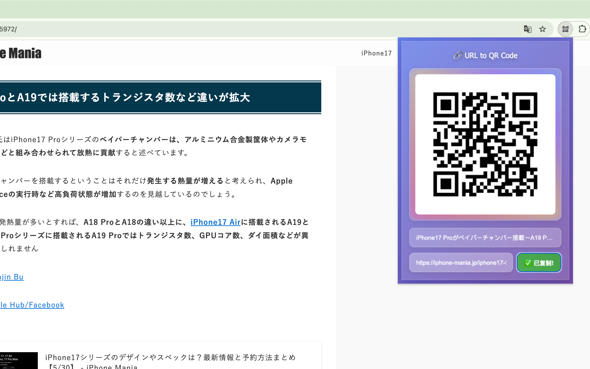

# URL to QR Code Extension | URL转二维码 浏览器扩展

  

  <strong>A modern, beautiful, and easy-to-use Chrome extension that instantly converts the current tab's URL into a QR code, featuring a stunning glassmorphism and neon-glow interface.</strong>
   
  <strong>一款现代、美观、易用的Chrome浏览器扩展，可以即时将当前页面的URL转换为二维码。拥有惊艳的毛玻璃质感和霓虹灯发光特效界面。</strong>

---

## 🇬🇧 English

### ✨ Features

- **Instant QR Code Generation**: Automatically generates a QR code for the active tab's URL.
- **Stunning Modern UI**: A beautiful interface with glassmorphism (frosted glass) and neon glow effects.
- **Copy URL**: Easily copy the URL with a single click.
- **Page Title Display**: Shows the title of the current page, with graceful text overflow for long titles.
- **Lightweight & Fast**: Optimized for performance, with no unnecessary libraries.
- **Keyboard Shortcut**: Open the popup quickly using `Ctrl+Q` (`MacCtrl+F` on macOS).

### 📦 Installation

1.  Download this repository as a ZIP file via `Code > Download ZIP` and unzip it.
2.  Open Chrome and navigate to `chrome://extensions`.
3.  Enable **Developer mode** in the top right corner.
4.  Click **Load unpacked**.
5.  Select the `extension` directory from the unzipped folder.

### 🚀 How to Use

-   Click the extension icon in the Chrome toolbar to open the QR code popup.
-   Alternatively, use the keyboard shortcut: `Ctrl+Q` (or `MacCtrl+F` on macOS).
-   The QR code for the current URL will be displayed instantly.

---

## 🇨🇳 中文

### ✨ 功能特性

- **即时生成二维码**: 自动为当前标签页的URL生成二维码。
- **惊艳的现代UI**: 拥有毛玻璃质感（磨砂玻璃）和霓虹灯发光特效的精美界面。
- **复制链接**: 一键轻松复制URL。
- **显示页面标题**: 展示当前页面的标题，过长的标题会优雅地显示省略号。
- **轻量快速**: 为性能而优化，不包含不必要的库。
- **快捷键**: 使用 `Ctrl+Q` (macOS上为 `MacCtrl+F`) 快速打开弹窗。

### 📦 安装指南

1.  通过 `Code > Download ZIP` 下载本仓库的ZIP文件并解压。
2.  打开Chrome浏览器，访问 `chrome://extensions`。
3.  在右上角开启 **开发者模式**。
4.  点击 **加载已解压的扩展程序**。
5.  选择解压后文件夹中的 `extension` 目录。

### 🚀 使用方法

-   点击Chrome工具栏中的扩展图标，即可打开二维码弹窗。
-   或者，使用键盘快捷键：`Ctrl+Q` (macOS上为 `MacCtrl+F`)。
-   当前页面的二维码将会被立即展示。
